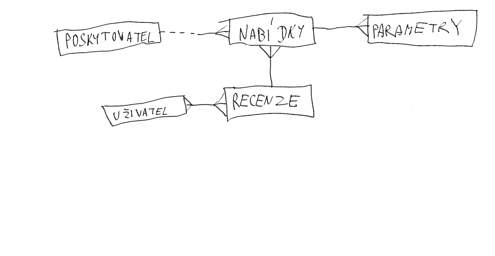

# Databáze poskytovatelů serverů a jejich nabídky SERVER4U

*Autor: Lukáš Hrtan <lukas.hrtan.s@gyarab.cz>*

Ročníkový projekt z předmětu webové technologie ve školním roce 2024/2025.

## Odborný článek

SERVER4U je webová aplikace dostupná na <https://SERVER4U.gyarab.cz>.

V administraci se spravuje databáze poskytovatelů a jejich nabídky, kde každá nabídka bude pod poskytovatelem a bude mít data, která poskytovatel dává na svém webu. Každá tato nabídka bude vždy ve finále odkazovat na web poskytovatele, kde si tento server bude moct zájemce pronajmout.

Homepage ukazuje základní nabídky, které si může zájemce vyfiltrovat podle ceny poskytovatele a základních parametrech serverů (např. počet jader, paměť, atd.). Nabídku tvoří kartičky, kde bude zobrazena cena, poskytovatel a základní parametry serveru (např. počet jader, komponenty jako CPU, RAM, paměť, atd.). Kliknutím na kartičku se zobrazí podrobná nabídka serveru, kde se zobrází všechny parametry serveru a zároveň tlačítko na přidání nabídky do Wish Listu (neboli košík) a tlačítko, které zájemce odkáže na web poskytovatele. 

Na každé naší stránce je menu, které vás odkazuje buď na Homepage nebo na Poskytovatelé nebo na Wish List. Možnost filtrování je na každé naší stránce kromě stránky podrobné nabídky serveru.

Na stránce Poskytovatelé je možné vidět všechny poskytovatele a jejich pár nabídek. Vedle názvu poskytovatele bude kolik má nabídek. Na stránce Wish List se zobrazujou všechny nabídky, které si zájemce přidá do tohoto seznamu. 

## Wireframe

## DB schema

